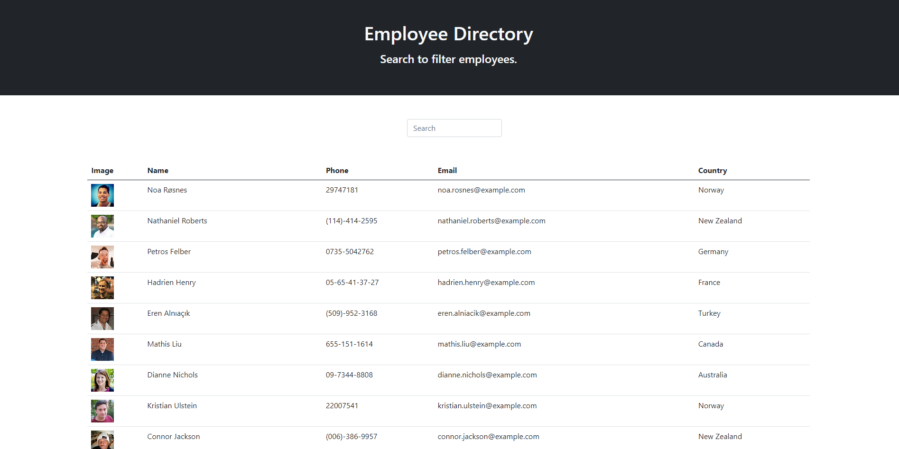

# REACT-EmployeeDirectory

## Description

A searchable table of users, using the RandomUser API. Created with React.js

## Technologies

- React.js
- Javascript
- npm packages
  - create-react-app
  - axios
  - bootstrap

## Table of Contents

  - [Description](#description)
  - [Technologies](#technologies)
  - [Table of Contents](#table-of-contents)
  - [Screenshot](#screenshot)
  - [Deployment](#deployment)
  - [Contributing](#contributing)

## Screenshot

## Deployment

[Deployed App](https://bhutchingson.github.io/employee-directory/)

## Contributing

GitHub: https://github.com/bHutchingson